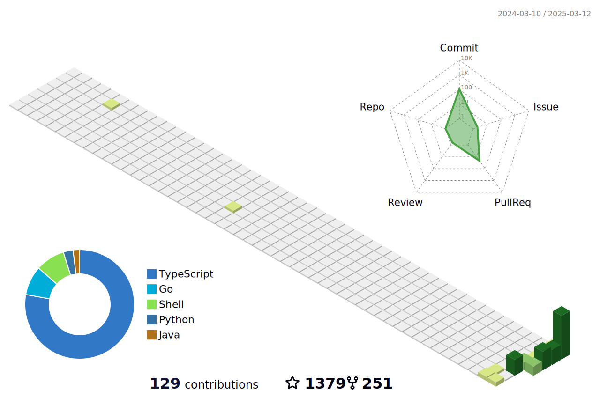

#### :rocket: My Projects

* GitHub Actions
    * [yoshi389111/github-profile-3d-contrib](https://github.com/yoshi389111/github-profile-3d-contrib) - Create a 3D GitHub Contribution Calendar.
* VS Code extensions ([marketplace](https://marketplace.visualstudio.com/publishers/yoshi389111))
    * [yoshi389111/vscode-md-table-rainbow](https://github.com/yoshi389111/vscode-md-table-rainbow) - Color each column of the markdown table.
    * [yoshi389111/visible-whitespace](https://github.com/yoshi389111/visible-whitespace) - Make whitespace visible.
* Command line tools
    * [yoshi389111/pong-is-not-ping](https://github.com/yoshi389111/pong-is-not-ping) - POng is Not pinG
    * [yoshi389111/power-hello](https://github.com/yoshi389111/power-hello) - Create SVG images of powerful keystrokes.
    * [yoshi389111/git-turf](https://github.com/yoshi389111/git-turf) - Outputs ASCII art to the GitHub contribution graph.
    * [yoshi389111/git-caesar](https://github.com/yoshi389111/git-caesar) - Encrypt/decrypt files passwordlessly using GitHub's public key.
* Tech blog: [dev.to](https://dev.to/yoshi389111)

#### :japan: My Projects (Japanease only)

* [yoshi389111/kinokobooks](https://github.com/yoshi389111/kinokobooks) - 「きのこ本」を勝手に電子書籍化
* [yoshi389111/dq1pswd](https://github.com/yoshi389111/dq1pswd) - ふっかつのじゅもんを作れます。１の方です。
* [yoshi389111/dq2pswd](https://github.com/yoshi389111/dq2pswd) - ふっかつのじゅもんを作れます。２の方です。
* Tech blog: [Qiita](https://qiita.com/yoshi389111) / [Zenn](https://zenn.dev/yoshi389111)

#### :memo: Misc

* [LGTM collections](https://yoshi389111.github.io/yoshi389111/lgtm.html)

